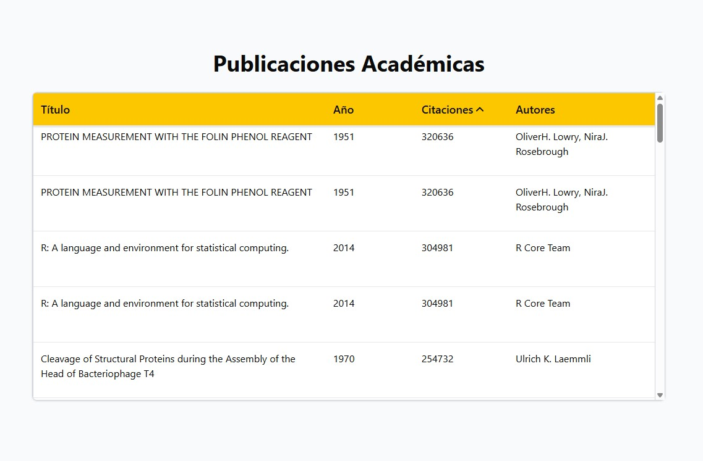

<h1 align="center">
    Academic Publications Table
</h1>

<h1 align="center">
  
</h1>

<h3 align="center">
  <a href="https://cart-ju.netlify.app/" target="_blank">Access demo page</a>
<h3 >

# Index

- [About](#-about)
- [Technologies used](#-technologies-used)
- [How to install and run the project](#-how-to-install-and-run-the-project)

## 🔖&nbsp; About

**Academic Publications Table** is a React application that displays a list of academic publications in a performant virtualized table.
It fetches data using a custom hook and renders rows efficiently with react-virtual and tanstack/react-table, integrating sorting and smooth scrolling.
The UI components leverage Tailwind CSS and shadcn/ui for styling and accessibility.


---

## 🚀 Technologies used

The project was developed using the following technologies

- React 19
- TypeScript
- Tailwind CSS
- shadcn/ui
- TanStack Table
- TanStack Virtual

---

## 🗂 How to install and run the project

```bash
# Clone the repository
git clone https://github.com/JuFML/openalex-table.git

# Enter the project folder
cd openalex-table

# Install dependencies
npm install

# Run the project
npm run dev
```
---

Developed ❤ by Juliana Fernandez